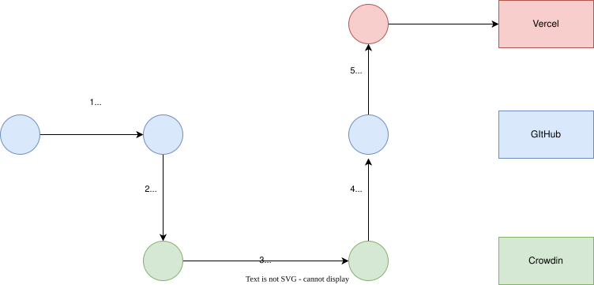

# About this repository

This is the repository for my [resume](https://resume.spin-glass.dev/)
This resume is developed by Next.js template [Nextra](https://nextra.site/)

## Updating workflow



1. Update `pages/ja/index.mdx` in Japanese

2. Translate into English using [Crowdin](https://crowdin.com/profile/spin-glass)

3. After aprroving translation, execute `crowdin_sync_and_merge` workflow in [GitHub Actions](https://github.com/spin-glass/resume/actions) manually

## Development Environment

```{sh}
pnpm run dev
```

## PDF Generation

Generate PDF from the current resume content:

```{sh}
npm run pdf
```

Watch for changes and auto-generate PDF:

```{sh}
npm run pdf:watch
```

### デプロイ

職務経歴を更新してGitHub経由でVercelにデプロイ

```sh
# デフォルトメッセージでデプロイ
task update

# カスタムメッセージでデプロイ
task update MESSAGE="プロジェクト経験を追加"
```

実行内容

- PDF/DOCX生成
- git add
- git commit
- git push（Vercelが自動デプロイ）

## Requirements

- `pandoc` with XeLaTeX support
- Japanese fonts (Hiragino Mincho Pro)
