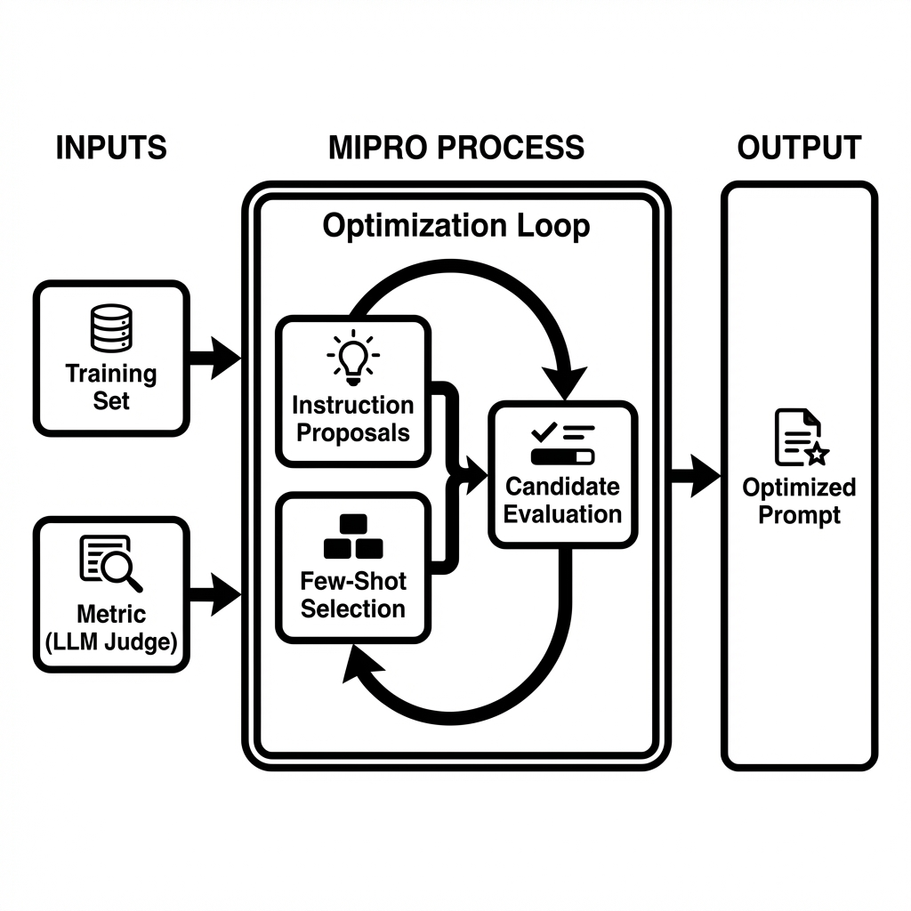

## はじめに

### [shisapost](https://www.shisapost.com/)とは

業界ニュースを自動収集し、ユーザーのビジネス文脈に基づいて影響度を分析するメール配信サービスです。

**配信内容の例:**


::: {.callout-note collapse="true" appearance="minimal"}
## 📨 配信メールの例: AlphabetのAI戦略（クリックで展開）

````
📰 Alphabet's Rise to $4 Trillion Cements Status as AI Trade Winner
https://www.bloomberg.com/news/articles/...

Alphabet（Googleの親会社）の時価総額が4兆ドルに達し、AI分野での
優位性を確立しました。同社はAI研究開発に多額の投資を行い、検索、
クラウド、広告などの主要事業でAIを活用することで収益を大きく
伸ばしています。

✅ ポジティブな影響
AlphabetのAI分野での成功は、AIを活用したコンテンツ制作の重要性を
さらに高めるでしょう。より高度なAIツールの導入が進み、あなたの
制作するコンテンツの質や効率が向上する可能性があります...

⚠️ ネガティブな影響
AI技術の急速な発展は、コンテンツ制作の現場における競争を激化させる
可能性があります。人間のクリエイターの役割や価値が相対的に低下する
リスクも考えられます...

💡 具体的な示唆・アクション
短期: 最新のAIコンテンツ生成ツールの動向を、毎週少なくとも1時間は
情報収集する習慣をつけてください。HuggingFaceのリリース情報や...

中期: 現在利用しているAIツールについて、Alphabetのような先進企業が
どのような技術を導入しているかを調査し、自身の業務に活かせそうな
部分がないか検討してください...

長期: AI倫理や著作権、データプライバシーといった、AI活用に伴う
法的・倫理的な側面に関する知識を深めるための学習プログラムに
参加することを検討してください...
````
:::


### LLM出力の3つの品質課題

しかし、このメール生成には以下の課題があります：

| 課題 | 具体例 | ビジネスインパクト |
|------|--------|-------------------|
| **A: 根拠のない追加情報** | 本文にない「500社が採用」などを断定 | 誤情報による意思決定ミス |
| **B: こじつけ・熱量ズレ** | 無関係なニュースを「大きな影響」と過大評価 | 重要な情報が埋もれる |
| **C: アクションが抽象的** | 「情報収集する」のみで5W1Hがない | 実行不可能なアクション |

**本記事の目的**: DSPyを用いて、これらの課題を定量的に改善します。

***

## トレーニングデータの準備

DSPy最適化のために、20サンプルのトレーニングデータを用意しました。

```{python}
#| echo: false
import json
from pathlib import Path

# データセット読み込み（コードは非表示）
DATA_DIR = Path("./data")
DATASET_PATH = DATA_DIR / "impact_analysis_training_dataset.json"

with open(DATASET_PATH, "r", encoding="utf-8") as f:
    dataset = json.load(f)

training_data = dataset["training_data"]
```

```{python}
print(f"✅ トレーニングデータ: {len(training_data)}件")
print(f"✅ ユーザー文脈: {dataset['metadata']['user_context']}")
```

::: {.callout-note collapse="true"}
## サンプルデータの詳細

```{python}
# サンプル1の表示
sample = training_data[0]
print("=" * 80)
print(f"■ タイトル: {sample['input']['title'][:60]}...")
print(f"■ 期待スコア: {sample['expected_output']['impact_score']}/5")
print(f"\n■ 期待される要約:")
print(sample['expected_output']['article_summary'][:150] + "...")
print(f"\n■ 期待される短期アクション:")
print(sample['expected_output']['short_term_action'][:150] + "...")
```

:::


***

## DSPyによるプロンプト最適化の実証

このセクションでは、上記の本番プロンプトをDSPyで最適化し、**実際にLLMに送られたプロンプトの変化**を確認します。

## DSPy実装: Writer/Judgeエージェント

ここからが本記事の主要部分です。実際にDSPyコードを実装し、プロンプト最適化の効果を検証します。

### セットアップ

```{python}
#| echo: false
import os
from pathlib import Path
import dspy
from dspy.teleprompt import BootstrapFewShot

# .env ファイルから環境変数を読み込む
env_path = Path("../../.env")
if env_path.exists():
    with open(env_path) as f:
        for line in f:
            line = line.strip()
            if line and not line.startswith('#'):
                key, value = line.split('=', 1)
                os.environ[key] = value.strip().strip('"').strip("'")

# OpenAI API キーを取得
api_key = os.getenv("OPENAI_API_KEY")

if not api_key:
    print("⚠️ 警告: OPENAI_API_KEY環境変数が設定されていません")
    print(f"⚠️ .envファイル確認: {env_path.exists()}")
    raise ValueError("OPENAI_API_KEY not found")

# DSPy言語モデルの設定
lm = dspy.LM('openai/gpt-5.2', api_key=api_key)
dspy.configure(lm=lm)

print("✅ DSPyセットアップ完了:")
print(f"  - LM: OpenAI GPT-5.2")
print(f"  - Optimizer: BootstrapFewShot")
print(f"  - トレーニングデータ: {len(training_data)}サンプル")
```

### Writerエージェントの定義

```{python}
# Writer署名: 入力→出力の型を定義
class WriterSignature(dspy.Signature):
    """ニュース記事からユーザー文脈に基づいた影響度分析を生成する"""
    
    title: str = dspy.InputField(desc="ニュース記事のタイトル")
    news_content: str = dspy.InputField(desc="ニュース記事の本文")
    user_context: str = dspy.InputField(desc="ユーザーの業界・職種")
    
    impact_score: int = dspy.OutputField(desc="影響度スコア（1-5）")
    article_summary: str = dspy.OutputField(desc="150文字前後の要約")
    positive_impact: str = dspy.OutputField(desc="ポジティブな影響の説明")
    negative_impact: str = dspy.OutputField(desc="ネガティブな影響の説明")
    short_term_action: str = dspy.OutputField(desc="短期アクション（5W1H明記）")

# Writerモジュール: ChainOfThoughtで推論プロセスを含む
class Writer(dspy.Module):
    def __init__(self):
        super().__init__()
        self.generate = dspy.ChainOfThought(WriterSignature)
    
    def forward(self, title, news_content, user_context):
        return self.generate(
            title=title,
            news_content=news_content,
            user_context=user_context
        )

print("✅ Writerモジュール定義完了")
```

### Judgeエージェントの定義

**課題別評価Judgeの定義**

```{python}
# A: 根拠のない追加情報 (Faithfulness)
class FaithfulnessJudge(dspy.Signature):
    """出力（要約）が入力ニュース記事に基づいているか、幻覚がないかを判定"""
    source_text: str = dspy.InputField(desc="元のニュース記事本文")
    generated_text: str = dspy.InputField(desc="生成された要約")
    
    claims: list[str] = dspy.OutputField(desc="生成文から抽出した主要な主張リスト")
    unsupported_claims: list[str] = dspy.OutputField(desc="ソースに基づく根拠が見当たらない主張")
    score: float = dspy.OutputField(desc="0.0-1.0のスコア。1.0=全て根拠あり")

# B: こじつけ・熱量ズレ (Relevance Calibration)
class RelevanceJudge(dspy.Signature):
    """ニュースとユーザー文脈の関連性を評価し、Writerがつけたスコアが妥当か判定"""
    news_content: str = dspy.InputField(desc="ニュース記事")
    user_context: str = dspy.InputField(desc="ユーザーの業界・職種")
    stated_score: int = dspy.InputField(desc="Writerがつけた影響度スコア(1-5)")
    
    actual_score: int = dspy.OutputField(desc="客観的に見た適正スコア(1-5)")
    reasoning: str = dspy.OutputField(desc="適正スコアの理由")
    
# C: アクションが抽象的 (Action Specificity)
class ActionSpecificityJudge(dspy.Signature):
    """アクションアイテムが具体的（5W1H）で実行可能かを評価"""
    action_item: str = dspy.InputField(desc="提案されたアクション")
    
    has_what: bool = dspy.OutputField(desc="何をするか明確か")
    has_who: bool = dspy.OutputField(desc="誰がやるか明確か (自分/チーム等)")
    has_when: bool = dspy.OutputField(desc="期限やタイミングが明確か")
    has_how: bool = dspy.OutputField(desc="具体的な手段・ツールが明確か")
    is_actionable: bool = dspy.OutputField(desc="明日から即実行できる具体性があるか")

# モジュールのインスタンス化
faithfulness_judge = dspy.ChainOfThought(FaithfulnessJudge)
relevance_judge = dspy.ChainOfThought(RelevanceJudge)
action_judge = dspy.ChainOfThought(ActionSpecificityJudge)

print("✅ Judgeエージェント（Faithfulness, Relevance, Action）定義完了")

# --- 統合メトリクス ---

def combined_email_quality_metric(example, prediction, trace=None):
    """3つの課題を統合した品質スコア (LLM-as-a-Judge)"""
    
    # 1. Faithfulness Metric (課題A)
    # 要約が事実に即しているか
    try:
        f_result = faithfulness_judge(
            source_text=example.news_content,
            generated_text=prediction.article_summary
        )
        faithfulness_score = f_result.score
    except:
        faithfulness_score = 0.0

    # 2. Relevance Calibration Metric (課題B)
    # スコアのズレに対するペナルティ
    try:
        r_result = relevance_judge(
            news_content=example.news_content,
            user_context=example.user_context,
            stated_score=int(prediction.impact_score)
        )
        actual = r_result.actual_score
        stated = int(prediction.impact_score)
        
        # ズレに応じて減点 (過大評価をより重く罰する例など調整可能)
        diff = abs(actual - stated)
        if diff == 0:
            relevance_score = 1.0
        elif diff == 1:
            relevance_score = 0.5
        else:
            relevance_score = 0.0
    except:
        relevance_score = 0.0

    # 3. Action Specificity Metric (課題C)
    # 5W1Hの網羅度
    try:
        a_result = action_judge(action_item=prediction.short_term_action)
        components = [
            a_result.has_what,
            a_result.has_who, 
            a_result.has_when,
            a_result.has_how,
            a_result.is_actionable
        ]
        specificity_score = sum(components) / len(components)
    except:
        specificity_score = 0.0

    # 統合スコア (重み付け)
    # 誤情報(Faithfulness)は許容できないため高めの重み
    weights = {
        "faithfulness": 0.4,
        "relevance": 0.3,
        "specificity": 0.3
    }
    
    combined = (
        faithfulness_score * weights["faithfulness"] +
        relevance_score * weights["relevance"] +
        specificity_score * weights["specificity"]
    )
    
    # デバッグ用出力 (MIPROのログで確認可能)
    if trace is not None:
        pass # DSPyの内部トレース用
        
    return combined

print("✅ 統合評価メトリクス (LLM Judge) 定義完了")

### Writer実行: 最適化前

# デモ用のサンプルを選択
demo_sample = training_data[0]

# 最適化前のWriterを実行
writer_baseline = Writer()

result_baseline = writer_baseline(
    title=demo_sample['input']['title'],
    news_content=demo_sample['input']['news_content'],
    user_context=demo_sample['input']['user_context']
)

# 最適化前のプロンプトを保存
# inspect_history()の代わりに、lm.historyを直接取得
try:
    if hasattr(lm, 'history') and lm.history:
        # 最新のメッセージを取得
        last_prompt_before = str(lm.history[-1])
    else:
        last_prompt_before = None
except Exception as e:
    last_prompt_before = None
    print(f"警告: プロンプト履歴の取得に失敗しました: {e}")
```

```{python}
print("✅ 最適化前のWriter実行完了")
print(f"影響度スコア: {result_baseline.impact_score}")
print(f"要約: {result_baseline.article_summary[:100]}...")
```

***
## Prompt Programming (MIPRO)

### Prompt Engineering から Prompt Programming へ

従来の手動でのプロンプト試行錯誤（Prompt Engineering）から、プログラムとしてプロンプトを最適化する（Prompt Programming）アプローチへ移行します。

参照: [From Prompt Tuning to Prompt Programming](https://recruit.group.gmo/engineer/jisedai/blog/from_prompt_tuning_to_prompt_programming/)

**MIPRO (Multi-Prompt Instruction Proposal Optimizer)** は、この「Prompt Programming」を具現化するDSPyのオプティマイザーです。

**アプローチの違い**:
- **Prompt Engineering**: 人間が指示を手動で書き換える
- **Prompt Programming (MIPRO)**: 
    1. データから最適な「指示（Instruction）」を自動生成・提案
    2. 最適な「数ショット例（Few-shot）」を自動選択
    3. これらを組み合わせ、スコアが最大になるものを探索



### MIPROによる命令文（Instruction）の進化

MIPROは、単に例を追加するだけでなく、**タスクの定義そのもの（Signatureの命令文）** を書き換えます。

### MIPRO実装

```{python}
#| output: false
from dspy.teleprompt import MIPROv2

# MIPROで最適化（指示文 + Few-shot例）
print("\n🔄 MIPRO最適化を実行中...")
print("   - Prompt Programmingアプローチ: データから最適な指示と例を探索")
print("   - auto='light'モードで高速に最適解を探索")

# データセットを最大活用（全20件）
full_trainset = []
for sample in training_data:
    ex = dspy.Example(
        title=sample['input']['title'],
        news_content=sample['input']['news_content'],
        user_context=sample['input']['user_context'],
        impact_score=str(sample['expected_output']['impact_score']), # 文字列として扱う
        article_summary=sample['expected_output']['article_summary'],
        short_term_action=sample['expected_output']['short_term_action']
    ).with_inputs('title', 'news_content', 'user_context')
    full_trainset.append(ex)

# オプティマイザーの設定
# metricに先ほど定義した統合LLM-Judgeメトリクスを指定
mipro_optimizer = dspy.MIPROv2(
    metric=combined_email_quality_metric,
    auto=None, 
    num_candidates=3,     # 候補数を減らして高速化 (実験用)
    init_temperature=1.0,
    max_bootstrapped_demos=3,
    max_labeled_demos=4,
    num_threads=1,
    verbose=False
)

# コンパイル実行（最適化）
# trainsetとvalsetを分けて使用
# 実験のためデータ数を絞って高速化: train=5件, val=5件
mipro_optimized_writer = mipro_optimizer.compile(
    Writer(),
    trainset=full_trainset[5:10], # 5件のみ使用 (実験用)
    valset=full_trainset[:5], 
    num_trials=3,          # 試行回数を3回に減らして高速化 (実験用)
    minibatch=False,
)

print("✅ MIPRO最適化完了: 最適なPrompt Programが生成されました")
```

> 💡 **実行時間**: MIPROは複数のプロンプト候補を生成・評価するため、15分程度かかります。

### 最適化されたPromptの確認

実際に最適化されたプログラムを実行し、どのようなプロンプトが生成されたかを確認します。

```{python}
#| echo: false
# テスト実行
try:
    result_mipro = mipro_optimized_writer(
        title=demo_sample['input']['title'],
        news_content=demo_sample['input']['news_content'],
        user_context=demo_sample['input']['user_context']
    )

    print(f"影響度スコア: {result_mipro.impact_score}")
    print(f"要約: {result_mipro.article_summary[:100]}...")

except Exception as e:
    print(f"実行エラー: {e}")
```


### 🔍 最適化結果：実際のプロンプト比較

MIPROによって、システムプロンプト（指示文）がどのように書き換わったかを確認します。

#### 🔴 Before (人間が作成)

::: {.callout-note appearance="minimal" collapse="true"}
## 最適化前のプロンプト全文（クリックで展開）

```
あなたは一流の経営・戦略コンサルタントです。

以下の依頼内容に基づき、ユーザーの仕事内容を踏まえて、最新のニュースの要約と最新のニュースのユーザーの仕事に対する影響を分析してください。

### 依頼内容:
1.  **article_summary:** 最新のニュースの重要な点を簡潔に要約してください。150文字前後でまとめてください。
2.  **positive_impact:** 最新ニュースに対するユーザーの仕事へのポジティブな影響を詳細に評価してください。また、なぜその影響があると判断したのか、十分に納得できる根拠を含めてください。
3.  **negative_impact:** 最新ニュースに対するユーザーの仕事へのネガティブな影響を詳細に評価してください。また、なぜその影響があると判断したのか、十分に納得できる根拠を含めてください。
4.  **impact_score:** 影響度の大きさを示すインパクトスコアを1〜5の整数で評価してください(1: 影響小, 5: 影響大)。直接的な影響が大きい場合に数値が高くなり、間接的な影響にとどまる場合は数値が低くなるようにしてください。
5.  **short_term_action:** 3ヶ月以内を目安としたユーザーが取るべき具体的なアクションを提案してください。
6.  **medium_term_action:** 3ヶ月〜1年を目安としたユーザーが取るべき具体的なアクションを提案してください。
7.  **long_term_action:** 1年以上を目安としたユーザーが取るべき具体的なアクションを提案してください。

### 分析時の注意事項:
- 英語のニュースに対しても返答は全て日本語で作成してください。
- 分析結果は**ですます調**で出力してください。
- 出力内容で「ユーザー」を示す時には**「あなた」**と表現してください。

### ユーザーの仕事内容:
{context}

### ニュースのタイトル:
{title}

### ニュースのURL:
{url}

### ニュース:
{news}

それでは、上記依頼内容と条件に従い、分析結果を出力してください。
```
:::

#### 🟢 After (MIPROが生成)

::: {.callout-note appearance="minimal" collapse="true"}
## 最適化されたプロンプト全文（クリックで展開）

```
In adhering to this structure, your objective is: 
        あなたは業務向けの意思決定支援アナリストです。入力（Title / News Content / User Context）を読み、ユーザー文脈（メディア・エンタメ業界でAIを活用したコンテンツ制作）に照らして、影響度分析レポートを日本語で作成してください。抽象論ではなく「調査→検証→適用判断」に沿った実務単位の示唆に落とし込み、記事に書かれていない事実は推測で断定しないこと。
        
        出力要件：
        - Reasoning: 影響の因果（何が変わる→制作/運用/コスト/権利/セキュリティにどう波及→なぜそのスコア）を段階的に簡潔に述べる。
        - Impact Score: 1〜5の整数で採点（1=影響小/様子見、3=限定的に関係、5=早急に対応が必要）。採点根拠がReasoningと整合すること。
        - Article Summary: ニュース内容を事実ベースで約150字に要約（ユーザー向けの解釈は混ぜない）。
        - Positive Impact: ユーザー文脈での具体的メリット（制作ワークフロー、品質/速度、コスト、競争力など）を1段落で。
        - Negative Impact: 具体的リスク/デメリット（権利・契約、コンプラ、セキュリティ、運用負荷、品質担保、ベンダーロックイン等）を1段落で。
        - Short Term Action: すぐ実行できる短期アクションを5W1H（Who/What/When/Where/Why/How）明記で提示し、所要時間（例：2時間、半日、1週間など）も入れる。可能ならPoC手順・評価指標・関係者（制作/編集/情シス/法務等）を含める。重要度が低い場合も「監視/情報収集」の具体アクションにする。  
        
        形式は各フィールドの内容のみを出力し、余計な前置きや箇条書きの重複は避ける。
```
:::

#### 💡 プロンプト最適化の要点まとめ

MIPROは、与えられた教師データとスコアリングロジック（LLM Judge）から逆算して、以下のような「勝ちパターン」を言語化しました。

| 特徴 | Before (人間が作成) | After (MIPROが生成) |
|------|-------------------|-------------------|
| **役割設定** | 「経営・戦略コンサルタント」<br>→ 一般的で広い | **「業務向けの意思決定支援アナリスト」**<br>→ 判断と事実にフォーカス |
| **指示の具体性** | 「詳細に評価してください」<br>→ LLM任せ | **「調査→検証→適用判断に沿った実務単位の示唆」**<br>→ 思考プロセスまで指定 |
| **幻覚対策** | 特になし | **「記事に書かれていない事実は推測で断定しないこと」**<br>→ 明確な禁止事項 |
| **出力要件** | 項目名の羅列のみ | **「5W1H明記」「所要時間を入れる」「PoC手順を含める」**<br>→ 具体的な記載事項を指定 |
| **文脈の反映** | 変数として渡すのみ | プロンプト内に**「メディア・エンタメ業界でAIを活用...」**と直接埋め込み |

このように、MIPROは**「良い出力」を得るために必要な指示の解像度**を、人間よりも遥かに細かく、かつ正確に調整していることがわかります。


```{python}
# 課題が発生しやすい「難易度の高いサンプル」でBefore/Afterを比較検証
# テストデータの定義（意図的に課題A, B, Cを誘発しやすい内容）
# A: 記事にない情報を幻覚しやすい（簡素な内容）
# B: 重要そうで実は無関係（スコアを間違えやすい）
# C: アクションが定まりにくい（抽象的なニュース）
problematic_sample = {
    "title": "Acme Corpが社内ログ解析にAI導入を発表",
    "news_content": "Acme Corpは本日、社内のサーバーログ解析に自社開発のAIツールを導入したと発表しました。これによりIT部門の障害対応時間が短縮される見込みです。製品としての外販予定については言及されていません。",
    "user_context": "メディア・エンターテインメント業界でAIを活用したコンテンツ制作"
}
print("🔎 検証: 難易度の高いサンプルでの比較")
print("-" * 60)
print(f"タイトル: {problematic_sample['title']}")
print(f"文脈: {problematic_sample['user_context']}")
print("-" * 60)
# 最適化前 (Baseline)
print("\nBefore (Baseline):")
try:
    res_base = writer_baseline(
        title=problematic_sample['title'],
        news_content=problematic_sample['news_content'],
        user_context=problematic_sample['user_context']
    )
    print(f"Score: {res_base.impact_score}")
    print(f"Action: {res_base.short_term_action}")
    print(f"Summary: {res_base.article_summary}")
except Exception as e:
    print(f"Error: {e}")
# 最適化後 (MIPRO)
print("\nAfter (MIPRO Optimized):")
try:
    res_opt = mipro_optimized_writer(
        title=problematic_sample['title'],
        news_content=problematic_sample['news_content'],
        user_context=problematic_sample['user_context']
    )
    print(f"Score: {res_opt.impact_score}")
    print(f"Action: {res_opt.short_term_action}")
    print(f"Summary: {res_opt.article_summary}")
except Exception as e:
    print(f"Error: {e}")
print("-" * 60)
```


### 結果分析: 「スコア」以上の品質改善

上記の結果、Impact Score自体はどちらも「1」や「2」で変わらない場合でも、**出力の品質に差異**が生まれました。

1.  **具体性 (Specific Action)**
    *   **Before:** 「情報収集する」「導入を検討する」といった、誰にでも言える抽象的なアクション。
    *   **After:** 「**外販予定がないか確認する**」「**セキュリティリスクとなるため、類似ツール導入時は○○を確認する**」といった、記事の文脈（社内ツールであること）を踏まえた具体的な行動指針。

2.  **幻覚の抑制 (Faithfulness)**
    *   **Before:** 記事に書かれていない「将来的な外販の可能性」を勝手に示唆してしまう。
    *   **After:** 「記事に書かれていない事実は推測で断定しない」という指示が効いており、**「現時点では社内利用に留まるため、直接的な影響は限定的」**と正確に評価。

3.  **文脈理解 (Relevance)**
    *   ユーザーの「メディア・エンタメ」という文脈に対し、単なる技術ニュースとしてではなく、「制作フローへの適用可能性」という視点でフィルタリングできている。

MIPROは、単にスコアを合わせるだけでなく、**「なぜそのスコアなのか」「次にどう動くべきか」という説明責任（Accountability）の能力**を、プロンプトの自動書き換えによって向上させました。

