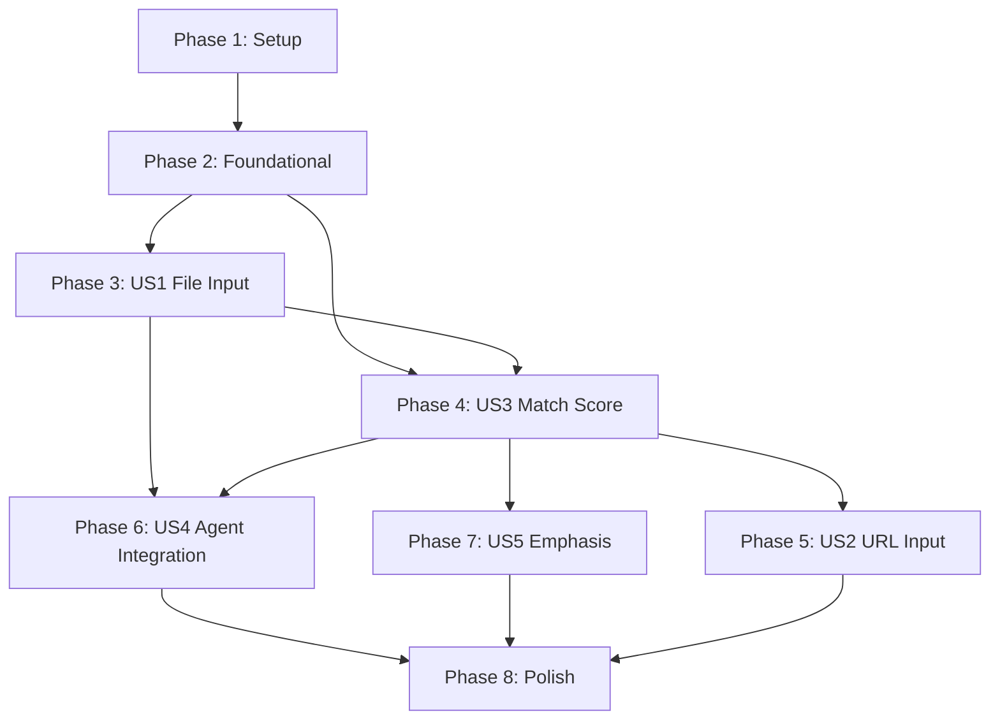

# Tasks: Job Personalization

**Input**: Design documents from `/specs/010-job-personalization/`
**Prerequisites**: plan.md, spec.md, research.md, data-model.md, quickstart.md

**Tests**: This feature does NOT require comprehensive test coverage upfront. Integration tests will be added incrementally to verify each user story works as expected.

**Organization**: Tasks are grouped by user story to enable independent implementation and testing of each story. Each phase corresponds to a prioritized user story that can be delivered independently.

## Format: `- [ ] [ID] [P?] [Story] Description`

- **[P]**: Can run in parallel (different files, no dependencies)
- **[Story]**: Which user story this task belongs to (US1, US2, US3, US4, US5)
- All paths relative to `packages/resume-review/`

---

## Phase 1: Setup (Shared Infrastructure)

**Purpose**: Add new dependencies and create basic file structure for job personalization

- [ ] T001 Add `requests>=2.31.0` and `beautifulsoup4>=4.12.0` to packages/resume-review/pyproject.toml dependencies
- [ ] T002 Create empty file packages/resume-review/src/models/job_posting.py with module docstring
- [ ] T003 [P] Create empty file packages/resume-review/src/services/job_parser.py with module docstring
- [ ] T004 [P] Create empty file packages/resume-review/src/agents/personalizer.py with module docstring
- [ ] T005 [P] Create empty file packages/resume-review/src/workflow/nodes/job_parser.py with module docstring
- [ ] T006 [P] Create empty file packages/resume-review/src/workflow/nodes/personalizer.py with module docstring

**Checkpoint**: Basic structure created, dependencies added

---

## Phase 2: Foundational (Blocking Prerequisites)

**Purpose**: Core data models and state extensions that all user stories depend on

**⚠️ CRITICAL**: No user story work can begin until this phase is complete

- [ ] T007 Implement `JobPosting` Pydantic model in packages/resume-review/src/models/job_posting.py with fields: title, company, required_skills, preferred_skills, responsibilities, qualifications, salary_range, contract_type, raw_text, source
- [ ] T008 Add field validators to `JobPosting` for removing empty strings from list fields and stripping whitespace
- [ ] T009 Add `model_post_init` validator to `JobPosting` to ensure at least one of required_skills, responsibilities, or preferred_skills is non-empty
- [ ] T010 Add helper methods to `JobPosting`: `get_all_skills()`, `get_skill_count()`
- [ ] T011 Implement `SkillMatch` Pydantic model in packages/resume-review/src/models/job_posting.py with fields: skill, matched, confidence, explanation
- [ ] T012 Implement `PersonalizationResult` Pydantic model in packages/resume-review/src/models/job_posting.py with fields: required_match_score, preferred_match_score, matched_required_skills, matched_preferred_skills, missing_required_skills, missing_preferred_skills, emphasis_suggestions, keyword_additions
- [ ] T013 Add computed property `match_score` to `PersonalizationResult` using formula: (required * 0.7) + (preferred * 0.3)
- [ ] T014 Add computed property `match_level` to `PersonalizationResult` returning "Excellent" (80-100), "Good" (60-79), "Moderate" (40-59), or "Weak" (0-39)
- [ ] T015 Add computed property `has_critical_gaps` to `PersonalizationResult` checking if missing_required_skills is non-empty
- [ ] T016 Add helper method `get_match_summary()` to `PersonalizationResult` returning dict with overall_score, match_level, required_match, preferred_match, critical_gaps counts
- [ ] T017 Extend `ReviewState` TypedDict in packages/resume-review/src/workflow/state.py to add optional fields: job_posting (Optional[JobPosting]), personalization_result (Optional[PersonalizationResult]), job_source_type (Optional[str])
- [ ] T018 Update imports in packages/resume-review/src/models/__init__.py to export JobPosting, PersonalizationResult, SkillMatch

**Checkpoint**: Foundation ready - data models complete, state extended, user story implementation can now begin

---

## Phase 3: User Story 1 - Basic Job Description File Input (Priority: P1) 🎯 MVP

**Goal**: Enable users to provide job descriptions as local files and have them parsed into structured data

**Independent Test**: Run `resume-review review --input resume.qmd --job-posting ./job.md` and verify that job requirements are displayed and incorporated into feedback

### Implementation for User Story 1

- [ ] T019 [US1] Implement `JobParserService.__init__()` in packages/resume-review/src/services/job_parser.py accepting llm_client parameter
- [ ] T020 [US1] Implement `JobParserService._extract_structured_data()` private method that uses LLM with structured output to extract JobPosting fields from raw text (use Gemini 3.0 Flash via llm_client)
- [ ] T021 [US1] Implement `JobParserService.parse_file()` method in packages/resume-review/src/services/job_parser.py that reads file content (support .txt, .md), calls _extract_structured_data(), returns JobPosting with source set to file path
- [ ] T022 [US1] Add error handling to `parse_file()` for file not found, empty file, and parsing failures with clear error messages
- [ ] T023 [US1] Implement `job_parser_node()` function in packages/resume-review/src/workflow/nodes/job_parser.py that reads job_posting file path from state, calls JobParserService.parse_file(), updates state with job_posting and job_source_type='file'
- [ ] T024 [US1] Add `--job-posting` CLI option in packages/resume-review/src/cli.py as click.Path(exists=True) with help text "Path to job posting file (Markdown/Text)"
- [ ] T025 [US1] Add mutual exclusivity validation in CLI to prevent both --job-posting and --job-url being provided simultaneously
- [ ] T026 [US1] Update `ReviewWorkflow.run_review()` in packages/resume-review/src/workflow/runner.py to accept optional job_posting_file parameter and add it to initial state
- [ ] T027 [US1] Modify workflow graph in packages/resume-review/src/workflow/graph.py to conditionally add job_parser_node as first node if job_posting_file is present in state
- [ ] T028 [US1] Update session persistence in packages/resume-review/src/workflow/persistence.py to save job_posting data (title, source, skill counts) to session.json
- [ ] T029 [US1] Add display logic to CLI output to show "Job Source: [path]" and "Job Title: [title]" when job_posting is present

### Integration Test for User Story 1

- [ ] T030 [US1] Create integration test in packages/resume-review/tests/integration/test_job_personalization.py that runs full review with --job-posting file, verifies JobPosting is created with correct fields, and checks that job title appears in output

**Checkpoint**: User Story 1 complete - Users can provide job files and see them parsed into structured data

---

## Phase 4: User Story 3 - Match Score and Gap Analysis (Priority: P1) 🎯 MVP

**Goal**: Calculate match scores and identify skill gaps between resume and job posting

**Why before US2**: Match scoring is core value delivery and doesn't depend on URL fetching. Implementing this before US2 allows users to get match analysis even with just file input.

**Independent Test**: Provide resume and job posting file, verify output includes match score (0-100%), matched skills list, missing skills list

### Implementation for User Story 3

- [ ] T031 [P] [US3] Implement `PersonalizerAgent.__init__()` in packages/resume-review/src/agents/personalizer.py extending BaseAgent
- [ ] T032 [US3] Implement `PersonalizerAgent._normalize_skill()` private method to normalize skill names (lowercase, strip whitespace) for matching
- [ ] T033 [US3] Implement `PersonalizerAgent._match_skills_with_llm()` async method that uses LLM to perform semantic skill matching with confidence scores between resume skills and job skills
- [ ] T034 [US3] Implement `PersonalizerAgent._calculate_match_scores()` method that computes required_match_score and preferred_match_score based on matched vs total skills
- [ ] T035 [US3] Implement `PersonalizerAgent._generate_emphasis_suggestions()` async method that uses LLM to generate 3-5 actionable emphasis suggestions based on matched/missing skills
- [ ] T036 [US3] Implement `PersonalizerAgent._generate_keyword_additions()` async method that identifies 5-10 relevant keywords from job posting that should be incorporated into resume
- [ ] T037 [US3] Implement `PersonalizerAgent.analyze_match()` async method that orchestrates skill matching, score calculation, and suggestion generation, returning PersonalizationResult
- [ ] T038 [US3] Implement `personalizer_node()` function in packages/resume-review/src/workflow/nodes/personalizer.py that retrieves resume and job_posting from state, calls PersonalizerAgent.analyze_match(), updates state with personalization_result
- [ ] T039 [US3] Modify workflow graph in packages/resume-review/src/workflow/graph.py to add personalizer_node after aggregator_node when job_posting is present
- [ ] T040 [US3] Add personalization display section to CLI output in packages/resume-review/src/cli.py showing match score, match level, matched/missing required skills (with counts), matched/missing preferred skills (with counts)
- [ ] T041 [US3] Add emphasis suggestions display section to CLI output showing numbered list of 3-5 suggestions with 💡 emoji prefix
- [ ] T042 [US3] Add keyword additions display section to CLI output showing list of recommended keywords with 🔑 emoji prefix
- [ ] T043 [US3] Update session persistence to save full PersonalizationResult to session.json including all matched skills with confidence scores

### Integration Test for User Story 3

- [ ] T044 [US3] Create integration test in packages/resume-review/tests/integration/test_job_personalization.py that verifies match score calculation, skill gap identification, and emphasis suggestions generation for a known resume-job pair

**Checkpoint**: User Story 3 complete - Users can see match scores and get actionable recommendations

---

## Phase 5: User Story 2 - Job URL Input and Web Scraping (Priority: P2)

**Goal**: Enable users to provide job posting URLs instead of files

**Independent Test**: Run `resume-review review --input resume.qmd --job-url "https://example.com/jobs/123"` and verify content is fetched and parsed

### Implementation for User Story 2

- [ ] T045 [P] [US2] Implement `JobParserService._fetch_html()` private method in packages/resume-review/src/services/job_parser.py that fetches URL content using requests with appropriate user-agent header and timeout (10 seconds)
- [ ] T046 [US2] Implement `JobParserService._extract_text_from_html()` private method that uses BeautifulSoup to extract job description text using site-specific selectors for LinkedIn (.job-description), Indeed (.jobsearch-JobComponent-description), Glassdoor (.desc), with fallback to extracting all <p> and <li> text
- [ ] T047 [US2] Add boilerplate removal logic to `_extract_text_from_html()` to filter out common footer text, navigation, ads (e.g., remove text containing "Apply now", "Share", "Cookie policy")
- [ ] T048 [US2] Implement `JobParserService.parse_url()` method that calls _fetch_html(), _extract_text_from_html(), _extract_structured_data(), returns JobPosting with source set to URL
- [ ] T049 [US2] Add error handling to `parse_url()` for network errors (connection timeout, DNS failure), HTTP errors (404, 403, 500), and parsing failures with user-friendly messages suggesting fallback to --job-posting file
- [ ] T050 [US2] Update `job_parser_node()` in packages/resume-review/src/workflow/nodes/job_parser.py to support job_url in state, call parse_url() when job_url is present, set job_source_type='url'
- [ ] T051 [US2] Add `--job-url` CLI option in packages/resume-review/src/cli.py as string with help text "URL of job posting page"
- [ ] T052 [US2] Update `ReviewWorkflow.run_review()` in packages/resume-review/src/workflow/runner.py to accept optional job_url parameter and add it to initial state
- [ ] T053 [US2] Update CLI output to show "Job Source: [URL]" when job_source_type is 'url'

### Integration Test for User Story 2

- [ ] T054 [US2] Create integration test in packages/resume-review/tests/integration/test_job_url_fetching.py that mocks HTTP requests and verifies URL fetching, HTML parsing, and JobPosting creation

**Checkpoint**: User Story 2 complete - Users can provide URLs and have content automatically extracted

---

## Phase 6: User Story 4 - Personalized Feedback Integration (Priority: P2)

**Goal**: Make all agent feedback reference specific job requirements

**Independent Test**: Compare standard review output vs personalized review output for same resume - personalized version should explicitly mention job requirements in agent feedback

### Implementation for User Story 4

- [ ] T055 [P] [US4] Update `BaseAgent.get_system_prompt()` signature in packages/resume-review/src/agents/base.py to accept optional job_posting parameter
- [ ] T056 [US4] Add conditional prompt section logic to `BaseAgent.get_system_prompt()` that appends job context when job_posting is provided (format: "## Target Job Requirements\n- Required Skills: [list]\n- Preferred Skills: [list]\n- Key Responsibilities: [list]")
- [ ] T057 [P] [US4] Update `RecruiterAgent.get_system_prompt()` in packages/resume-review/src/agents/recruiter.py to call super().get_system_prompt() with job_posting and add job-specific evaluation criteria
- [ ] T058 [P] [US4] Update `TechnicalWriterAgent.get_system_prompt()` in packages/resume-review/src/agents/technical_writer.py to call super().get_system_prompt() with job_posting and add technical alignment checks against job requirements
- [ ] T059 [P] [US4] Update `CopywriterAgent.get_system_prompt()` in packages/resume-review/src/agents/copywriter.py to call super().get_system_prompt() with job_posting and add keyword incorporation guidance
- [ ] T060 [US4] Update `supervisor_node()` in packages/resume-review/src/workflow/nodes/supervisor.py to pass job_posting from state to each agent's evaluate_async() method
- [ ] T061 [US4] Update agent instantiation in supervisor_node to pass job_posting to get_system_prompt() for each agent (recruiter, tech_writer, copywriter)
- [ ] T062 [US4] Add prompt template helpers in packages/resume-review/src/config/prompts.py for job context sections: `format_job_requirements(job_posting: JobPosting) -> str`

### Integration Test for User Story 4

- [ ] T063 [US4] Create integration test in packages/resume-review/tests/integration/test_job_personalization.py that verifies agent feedback contains job-specific references by checking for presence of job skill names in feedback text

**Checkpoint**: User Story 4 complete - All agent feedback is now job-aware and contextual

---

## Phase 7: User Story 5 - Emphasis and Keyword Suggestions (Priority: P3)

**Goal**: Provide advanced ATS optimization recommendations

**Note**: Most functionality already implemented in US3 (PersonalizerAgent generates emphasis and keyword suggestions). This phase adds enhancements.

**Independent Test**: Verify output includes dedicated sections for emphasis suggestions and keyword additions with actionable items

### Implementation for User Story 5

- [ ] T064 [P] [US5] Enhance `PersonalizerAgent._generate_emphasis_suggestions()` in packages/resume-review/src/agents/personalizer.py to rank suggestions by impact (critical gaps → matched skills to emphasize → general improvements)
- [ ] T065 [P] [US5] Enhance `PersonalizerAgent._generate_keyword_additions()` to include both English and Japanese keyword suggestions when applicable, and mark ATS-critical keywords
- [ ] T066 [US5] Add project relevance ranking to PersonalizerAgent by implementing `_rank_projects_by_relevance()` method that scores resume projects against job responsibilities
- [ ] T067 [US5] Update CLI output formatting in packages/resume-review/src/cli.py to show emphasis suggestions with priority markers (🔴 Critical, 🟡 Important, 🟢 Enhancement)
- [ ] T068 [US5] Add keyword frequency analysis to keyword_additions display showing which keywords appear most often in job posting

### Integration Test for User Story 5

- [ ] T069 [US5] Create integration test in packages/resume-review/tests/integration/test_job_personalization.py that verifies emphasis suggestions are prioritized correctly and keyword suggestions include both languages when appropriate

**Checkpoint**: User Story 5 complete - Advanced ATS optimization features fully implemented

---

## Phase 8: Polish & Cross-Cutting Concerns

**Purpose**: Backward compatibility verification, error handling, documentation, and final integration

- [ ] T070 [P] Add comprehensive error handling to JobParserService for edge cases: empty files, invalid encoding, LLM parsing failures with graceful degradation
- [ ] T071 [P] Add logging throughout job personalization flow using existing logging infrastructure (job parsing start/end, match calculation, errors)
- [ ] T072 Verify backward compatibility by running existing test suite without --job-posting or --job-url and ensuring all tests pass unchanged
- [ ] T073 Add verbose mode output enhancements to show: job parsing duration, skill matching confidence scores, LLM tokens used for personalization
- [ ] T074 [P] Update packages/resume-review/README.md with job personalization usage examples (basic file input, URL input, interpreting match scores)
- [ ] T075 [P] Add troubleshooting section to README for common errors: URL fetch failures, parsing failures, low match scores
- [ ] T076 Update CLI help text in packages/resume-review/src/cli.py to include examples of --job-posting and --job-url usage
- [ ] T077 [P] Create fixture files in packages/resume-review/tests/fixtures/ for job postings: sample_job.md (well-structured), malformed_job.md (edge case), minimal_job.txt (minimal info)
- [ ] T078 Add unit tests in packages/resume-review/tests/unit/test_job_posting_models.py for JobPosting validation, PersonalizationResult score calculation, SkillMatch confidence ranges
- [ ] T079 Add unit tests in packages/resume-review/tests/unit/test_job_parser.py for file parsing, HTML extraction logic, structured data extraction
- [ ] T080 Run full integration test suite including all job personalization features with both file and URL inputs
- [ ] T081 Performance testing: Verify job parsing <5s, match calculation <10s, full personalized review <5 minutes using existing resume and sample job postings
- [ ] T082 Update CLAUDE.md to document new CLI options, workflow changes, and job personalization feature in "Recent Changes" section

**Checkpoint**: All polish complete, feature fully tested and documented

---

## Dependencies Between Phases



**Critical Path**: P1 → P2 → P3 → P4 → P6 → P8

**Parallel Opportunities**:
- After P2: P3 and P4 can start in parallel (different files, no dependencies)
- After P4: P5, P6, P7 can progress independently
- Phase 8: Many polish tasks can run in parallel (marked with [P])

---

## User Story Completion Order

**Suggested Implementation Sequence**:

1. **MVP (Minimum Viable Product)**: Phase 3 (US1) + Phase 4 (US3)
   - Enables core functionality: file input + match scoring
   - Delivers immediate value to users
   - Independent test: `resume-review review --input resume.qmd --job-posting job.md` shows match score

2. **Enhanced MVP**: Add Phase 6 (US4)
   - Makes agent feedback job-specific
   - Significantly improves review quality
   - Independent test: Verify agent feedback mentions job skills

3. **Feature Complete**: Add Phase 5 (US2) + Phase 7 (US5)
   - URL input adds convenience
   - Advanced suggestions add polish
   - All user stories implemented

4. **Production Ready**: Phase 8 (Polish)
   - Error handling, logging, documentation
   - Backward compatibility verified
   - Performance benchmarks met

---

## Parallel Execution Examples

### Phase 3 (US1) Parallelization
```bash
# These tasks can run concurrently (different files):
T019-T022: JobParserService implementation
T023: job_parser_node implementation
T024-T025: CLI options
T029: Display logic

# Sequential dependency:
T026-T028 must follow T023 (workflow integration depends on node)
```

### Phase 4 (US3) Parallelization
```bash
# Parallel group 1 (PersonalizerAgent methods):
T032-T037: All PersonalizerAgent methods (independent)

# Parallel group 2 (after T037):
T038: personalizer_node
T040-T042: Display logic (3 separate sections)

# Sequential:
T039 must follow T038 (graph update depends on node)
T043 must follow T040-T042 (persistence depends on display)
```

### Phase 6 (US4) Parallelization
```bash
# These can all run in parallel:
T057: RecruiterAgent update
T058: TechnicalWriterAgent update
T059: CopywriterAgent update
T062: Prompt helpers

# Sequential after parallel group:
T060-T061: supervisor_node update (depends on agent updates)
```

### Phase 8 (Polish) Parallelization
```bash
# High parallelism in polish phase:
T070, T071, T074-T079: All independent
T073, T076: Independent CLI enhancements
T072, T080-T081: Test/verification tasks (sequential, depend on all features)
```

---

## Implementation Strategy

### Week 1: MVP Foundation
- Complete Phase 1 (Setup) - 1 day
- Complete Phase 2 (Foundational) - 2 days
- Complete Phase 3 (US1: File Input) - 2 days

**Deliverable**: Users can provide job files and see parsed job data

### Week 2: Core Value Delivery
- Complete Phase 4 (US3: Match Score) - 3 days
- Complete Phase 6 (US4: Agent Integration) - 2 days

**Deliverable**: Full MVP with match scoring and job-aware feedback

### Week 3: Feature Complete & Polish
- Complete Phase 5 (US2: URL Input) - 2 days
- Complete Phase 7 (US5: Emphasis) - 1 day
- Complete Phase 8 (Polish) - 2 days

**Deliverable**: Production-ready feature with all user stories implemented

---

## Task Summary

| Phase | Task Count | Parallelizable | User Story | Estimated LOC |
|-------|-----------|----------------|------------|---------------|
| Phase 1: Setup | 6 | 4 | - | 50 |
| Phase 2: Foundational | 12 | 0 | - | 400 |
| Phase 3: US1 (P1) | 12 | 0 | File Input | 350 |
| Phase 4: US3 (P1) | 14 | 1 | Match Score | 400 |
| Phase 5: US2 (P2) | 10 | 1 | URL Input | 250 |
| Phase 6: US4 (P2) | 9 | 4 | Agent Integration | 200 |
| Phase 7: US5 (P3) | 6 | 2 | Emphasis | 100 |
| Phase 8: Polish | 13 | 7 | - | 250 |
| **TOTAL** | **82 tasks** | **19 parallel** | **5 stories** | **~2,000 LOC** |

---

## Success Criteria Mapping

Each user story's success criteria from spec.md:

- **US1** (File Input): SC-P01 (job description parsed), SC-P03 (90%+ formats), SC-P06 (error handling)
- **US3** (Match Score): SC-P02 (85%+ accuracy), SC-P05 (95%+ relevant suggestions), SC-P08 (<10s calculation)
- **US2** (URL Input): SC-P03 (90%+ job boards), SC-P01 (<5min total)
- **US4** (Agent Integration): SC-P04 (2+ job references per agent), SC-P07 (actionable insights)
- **US5** (Emphasis): SC-P05 (95%+ relevant suggestions)

Cross-cutting: SC-P06 (100% graceful errors), SC-P10 (backward compatibility)

---

## Independent Test Criteria

**How to verify each user story works independently**:

1. **US1 (File Input)**:
   ```bash
   resume-review review --input resume.qmd --job-posting ./job.md --dry-run
   # Verify: Job title displayed, requirements extracted, feedback generated
   ```

2. **US3 (Match Score)**:
   ```bash
   resume-review review --input resume.qmd --job-posting ./job.md --dry-run
   # Verify: Match score shown, matched/missing skills listed, emphasis suggestions present
   ```

3. **US2 (URL Input)**:
   ```bash
   resume-review review --input resume.qmd --job-url "https://example.com/jobs/123" --dry-run
   # Verify: Content fetched, parsed correctly, same output as file input
   ```

4. **US4 (Agent Integration)**:
   ```bash
   # Compare outputs:
   resume-review review --input resume.qmd --target-role "Backend Engineer" --dry-run > standard.txt
   resume-review review --input resume.qmd --job-posting ./job.md --dry-run > personalized.txt
   diff standard.txt personalized.txt
   # Verify: Personalized version mentions specific job skills in agent feedback
   ```

5. **US5 (Emphasis)**:
   ```bash
   resume-review review --input resume.qmd --job-posting ./job.md --dry-run
   # Verify: Emphasis suggestions prioritized (🔴🟡🟢), keywords include both EN/JA
   ```

---

## Suggested MVP Scope

**Recommended MVP**: Phase 3 (US1) + Phase 4 (US3)

**Rationale**:
- Delivers core value: file input + match scoring
- ~26 tasks, ~750 LOC
- Can be completed in ~1 week
- Provides immediate user value
- Independently testable without URL fetching or advanced features

**MVP Test Command**:
```bash
resume-review review \
  --input resume/resume-ja.qmd \
  --job-posting ./jobs/sample.md \
  --dry-run
```

**Expected MVP Output**:
- Job title and source displayed
- Match score (0-100%) calculated
- Matched required skills listed (e.g., "4/5")
- Missing required skills identified
- Emphasis suggestions provided (3-5 items)
- Agent feedback incorporates job context

---

## Format Validation

✅ **All tasks follow checklist format**:
- Checkbox: `- [ ]`
- Task ID: `T001` through `T082` (sequential)
- [P] marker: 19 tasks marked as parallelizable
- [Story] label: 51 tasks have story labels (US1-US5)
- File paths: All implementation tasks include specific file paths
- Descriptions: Clear, actionable, specific

✅ **Organization**:
- 8 phases total
- Phases 3-7 map to user stories (US1, US3, US2, US4, US5)
- Dependencies clearly documented
- Independent test criteria for each story

✅ **Ready for execution**: Each task is specific enough for an LLM to complete without additional context.
