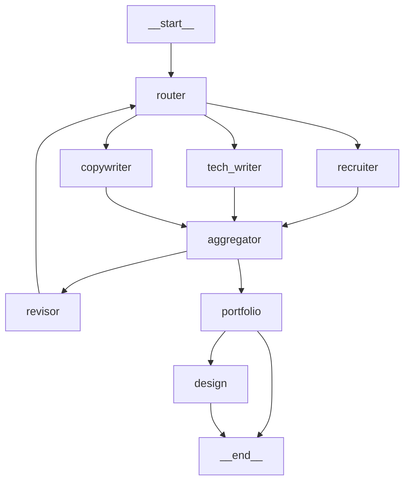

# Quickstart: StateGraph Agent Node Separation

**Feature**: 011-stategraph-node-separation
**For**: Developers working on the resume-review package
**Date**: 2026-01-09

---

## What Changed?

The LangGraph workflow has been refactored to expose individual agent nodes instead of hiding them in a "supervisor" node:

### Before
```
__start__ → supervisor → aggregator → [revisor/portfolio]
           (black box)
```

**Problem**: Three agents (recruiter, tech_writer, copywriter) run inside `supervisor_node` using `asyncio.gather`. You can't see which agent is executing or how long each takes.

### After
```
                    ┌─→ recruiter ──────┐
                    │                    │
__start__ → router ─├─→ tech_writer ────├─→ aggregator
                    │                    │
                    └─→ copywriter ──────┘
```

**Benefit**: Each agent is a separate LangGraph node with independent logging, timing, and error attribution.

---

## What Stayed the Same?

✅ **CLI Interface**: Same commands (`pnpm review`, `pnpm review:dry`, etc.)
✅ **Output Format**: Same ReviewSession structure, scores, and feedback
✅ **Performance**: Same parallel execution (all three agents run concurrently)
✅ **Agent Logic**: Recruiter, tech writer, and copywriter evaluation unchanged

---

## Running Tests

### Unit Tests

```bash
# Run all tests
cd packages/resume-review
pytest

# Run workflow tests specifically
pytest tests/integration/test_langgraph_workflow.py -v

# Run individual node tests (NEW)
pytest tests/unit/workflow/nodes/test_recruiter.py -v
pytest tests/unit/workflow/nodes/test_tech_writer.py -v
pytest tests/unit/workflow/nodes/test_copywriter.py -v
```

### Integration Test (End-to-End)

```bash
# Dry run (no file modifications)
pnpm review:dry

# Full review with verbose logging
pnpm review --verbose

# Expected output:
# INFO: Router: Starting agent evaluation (iteration 1)
# INFO: Starting recruiter node
# INFO: Starting tech_writer node
# INFO: Starting copywriter node
# DEBUG: Recruiter score: 8.5/10.0
# INFO: Recruiter node completed in 12.34s
# DEBUG: Tech writer score: 7.0/10.0
# INFO: Tech writer node completed in 15.67s
# DEBUG: Copywriter score: 8.0/10.0
# INFO: Copywriter node completed in 10.23s
# INFO: Aggregator: Collecting feedback from agent nodes
# DEBUG: Received feedback from 3 agents
# INFO: Integrated score: 7.95 (threshold: 8.0)
```

---

## Viewing Logs

### Per-Agent Timing

With the new structure, you can see exactly how long each agent takes:

```bash
pnpm review --verbose 2>&1 | grep "completed in"
```

**Output**:
```
INFO: Recruiter node completed in 12.34s
INFO: Tech writer node completed in 15.67s
INFO: Copywriter node completed in 10.23s
```

**Interpretation**: Total wall time ≈ 15.67s (max of three), not 38.24s (sum), confirming parallel execution.

### Error Attribution

If an agent fails, you'll see which one:

```bash
# Before (unclear)
ERROR: Supervisor node failed: API timeout

# After (clear)
ERROR: Error in tech_writer node: API timeout
```

---

## LangSmith Tracing

If LangSmith tracing is enabled, you'll see separate nodes for each agent:

### Enable LangSmith

```bash
export LANGCHAIN_TRACING_V2=true
export LANGCHAIN_API_KEY=<your-key>
export LANGCHAIN_PROJECT=resume-review
```

### Run Review

```bash
pnpm review --verbose
```

### View Trace in LangSmith UI

Navigate to https://smith.langchain.com and open your project. You should see:

**Before**: Single "supervisor" node with combined metrics
**After**: Three separate nodes with individual metrics:
- `recruiter`: 12.3s, 2500 input tokens, 800 output tokens, $0.003
- `tech_writer`: 15.7s, 3000 input tokens, 900 output tokens, $0.008
- `copywriter`: 10.2s, 2800 input tokens, 750 output tokens, $0.018

---

## Debugging Tips

### Which Agent is Slow?

```bash
pnpm review --verbose 2>&1 | grep "node completed"
```

Compare durations to identify bottlenecks.

### Which Agent Failed?

```bash
pnpm review --verbose 2>&1 | grep "Error in"
```

Example output:
```
ERROR: Error in recruiter node: RateLimitError: Request limit exceeded
```

### Verify Parallel Execution

Check that total duration ≈ max(agent durations), not sum:

```bash
pnpm review --verbose 2>&1 | grep -E "(Starting router|node completed)"
```

**Expected**:
```
INFO: Router: Starting agent evaluation (iteration 1)
INFO: Recruiter node completed in 12.34s
INFO: Tech writer node completed in 15.67s  ← Slowest
INFO: Copywriter node completed in 10.23s
INFO: Aggregator: ...
Total: ~15.7s (not 38s)
```

---

## Graph Visualization

Generate a visual graph of the workflow:

```python
# In Python REPL or script
from packages.resume_review.src.workflow.graph import build_review_workflow

workflow = build_review_workflow()
graph = workflow.get_graph()

# Export as mermaid diagram
print(graph.draw_mermaid())
```

**Output** (simplified):


---

## Common Issues & Solutions

### Issue: Tests Failing with "supervisor not found"

**Symptom**:
```python
AssertionError: assert "supervisor" in node_names
```

**Solution**: Update test to check for new node names:
```python
# Before
assert "supervisor" in node_names

# After
assert {"router", "recruiter", "tech_writer", "copywriter"} <= set(node_names)
```

---

### Issue: "recruiter_feedback" not in state

**Symptom**:
```python
KeyError: 'recruiter_feedback'
```

**Solution**: Check aggregator is using `state.get()` with default or conditional check:
```python
# Before (unsafe)
feedback = state["recruiter_feedback"]

# After (safe)
if "recruiter_feedback" in state:
    feedback = state["recruiter_feedback"]
```

---

### Issue: Aggregator executes before agents finish

**Symptom**: Aggregator logs show "No feedback collected" even though agents ran.

**Solution**: Verify fan-in edges are correctly defined in `graph.py`:
```python
workflow.add_edge("recruiter", "aggregator")
workflow.add_edge("tech_writer", "aggregator")
workflow.add_edge("copywriter", "aggregator")
```

LangGraph should automatically wait for all three edges before executing aggregator.

---

## Performance Verification

### Benchmark Before/After

1. Run baseline with old implementation (if available):
   ```bash
   git checkout main
   pnpm review --verbose > /tmp/before.log
   ```

2. Run with new implementation:
   ```bash
   git checkout 011-stategraph-node-separation
   pnpm review --verbose > /tmp/after.log
   ```

3. Compare total duration:
   ```bash
   grep "Total duration" /tmp/before.log
   grep "Total duration" /tmp/after.log
   ```

**Expected**: Within 5% (per SC-008 in spec.md)

---

## Migration Notes

### For Package Users (External)

✅ **No changes required** - CLI interface and output format unchanged.

### For Package Developers (Internal)

If you've extended the workflow:

1. **Custom Agents**: Add new agent nodes using the same pattern (see `contracts/README.md`)
2. **Custom Supervisors**: Refactor to fan-out/fan-in pattern instead of internal parallelism
3. **State Extensions**: Add optional TypedDict fields for new agent feedback

---

## Code Examples

### Adding a New Agent Node

Follow the pattern from `recruiter_node`:

```python
# In packages/resume-review/src/workflow/nodes/my_agent.py

import logging
import time
from typing import Any

from ...agents.my_agent import MyAgent
from ...config.model_config import AgentName
from ...models.feedback import Feedback
from ...services.llm_factory import LLMClientFactory
from ..state import ReviewState

logger = logging.getLogger("resume_review")


async def my_agent_node(state: ReviewState) -> dict[str, Any]:
    """My custom agent node."""
    start_time = time.perf_counter()
    logger.info("Starting my_agent node")

    try:
        client = LLMClientFactory.create_client(
            agent_name=AgentName.MY_AGENT,
            gemini_api_key=state.get("gemini_api_key"),
            openai_api_key=state.get("openai_api_key"),
            anthropic_api_key=state.get("anthropic_api_key"),
            override_model=state.get("override_model"),
        )

        agent = MyAgent(llm_client=client)
        feedback = await agent.evaluate_async(state["resume"], state["target_role"])

        duration = time.perf_counter() - start_time
        logger.info(f"My agent node completed in {duration:.2f}s")

        return {"my_agent_feedback": feedback}

    except Exception as e:
        duration = time.perf_counter() - start_time
        logger.error(f"Error in my_agent node after {duration:.2f}s: {e}")

        return {
            "my_agent_feedback": Feedback(
                agent_name="my_agent",
                score=5.0,
                strengths=["Evaluation failed"],
                issues=[],
                suggestions=[f"Error: {str(e)}"],
            )
        }
```

Then update `graph.py`:
```python
workflow.add_node("my_agent", my_agent_node)
workflow.add_edge("router", "my_agent")
workflow.add_edge("my_agent", "aggregator")
```

And `state.py`:
```python
class ReviewState(TypedDict, total=False):
    # ... existing fields ...
    my_agent_feedback: Optional[Feedback]
```

---

## Resources

- **Spec**: [spec.md](./spec.md) - Feature requirements and success criteria
- **Plan**: [plan.md](./plan.md) - Implementation plan with technical details
- **Research**: [research.md](./research.md) - LangGraph pattern research
- **Data Model**: [data-model.md](./data-model.md) - State schema extensions
- **Contracts**: [contracts/](./contracts/) - Node function contracts

---

## Getting Help

- **Issues**: Check [GitHub Issues](https://github.com/spin-glass/resume/issues) for known problems
- **Discussions**: Ask questions in GitHub Discussions
- **Documentation**: See CLAUDE.md for development guidelines

---

## Quick Reference

| Task | Command |
|------|---------|
| Run tests | `pytest` |
| Full review (verbose) | `pnpm review --verbose` |
| Dry run (no changes) | `pnpm review:dry` |
| Enable LangSmith | `export LANGCHAIN_TRACING_V2=true` |
| View logs | `pnpm review --verbose 2>&1 \| less` |
| Graph visualization | `python -c "from workflow.graph import build_review_workflow; print(build_review_workflow().get_graph().draw_mermaid())"` |

---

**Last Updated**: 2026-01-09
**Status**: Ready for development
