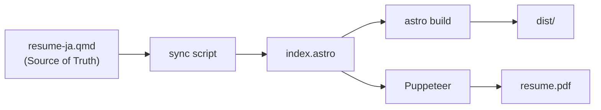

# Feature-014: Astro Migration Specification

## Overview

Migrate the resume web display from Next.js/Nextra to Astro 5 with Tailwind CSS 4, following the [spin-glass/astro-example](https://github.com/spin-glass/astro-example) reference repository.

## Problem Statement

The current web display has significant layout issues:
- Excessive left margin due to sidebar configuration
- Content balance is off
- Temporary fix using `--nextra-sidebar-width` is insufficient

## Goals

1. **Layout Optimization**: Sidebar-free, content-centered design
2. **Modern Stack**: Astro 5 + Tailwind CSS 4 (latest versions)
3. **Print-Ready**: A4 PDF generation via Puppeteer
4. **Performance**: Static site generation for faster load times
5. **Responsive**: Mobile/tablet optimized layouts

## Reference Repository

- **Source**: https://github.com/spin-glass/astro-example
- **Demo**: https://spin-glass.github.io/astro-example/

## Functional Requirements

| ID | Requirement | Priority |
|----|-------------|----------|
| FR-W01 | Rebuild `packages/web` with Astro 5 | Must |
| FR-W02 | Sidebar-free, content-centered layout | Must |
| FR-W03 | Responsive design (mobile/tablet) | Must |
| FR-W04 | Puppeteer-based PDF generation | Should |

## Non-Functional Requirements

| ID | Requirement |
|----|-------------|
| NFR-01 | Build time < 30 seconds |
| NFR-02 | Lighthouse performance score > 90 |
| NFR-03 | Print styles for A4 paper |

## Out of Scope

- Slidev integration (optional future enhancement)
- Blog/Quarto integration (separate feature)
- English version migration (follow-up task)

## Technical Design

### File Structure (After Migration)

```
packages/web/
├── astro.config.mjs
├── package.json
├── scripts/
│   └── generate-pdf.mjs
├── src/
│   ├── layouts/
│   │   └── Layout.astro
│   ├── pages/
│   │   └── index.astro
│   └── styles/
│       └── global.css
└── output/
    └── resume.pdf (generated)
```

### Data Flow



### Dependencies

```json
{
  "dependencies": {
    "astro": "^5.16.6",
    "tailwindcss": "^4.1.18",
    "@tailwindcss/vite": "^4.1.18"
  },
  "devDependencies": {
    "puppeteer": "^24.34.0"
  }
}
```

## Migration Strategy

1. **Parallel Development**: Create new Astro implementation alongside existing Next.js
2. **Content Extraction**: Port resume content from MDX to Astro data format
3. **Style Migration**: Convert Tailwind 3 styles to Tailwind 4 syntax
4. **Verification**: Compare output with reference demo
5. **Cutover**: Replace `packages/web` with new implementation
6. **Cleanup**: Remove Next.js dependencies and files

## Success Criteria

- [ ] Development server runs at `localhost:4321`
- [ ] Build completes without errors
- [ ] PDF generates with correct A4 layout
- [ ] Responsive layout works on mobile/tablet
- [ ] Visual parity with astro-example demo
